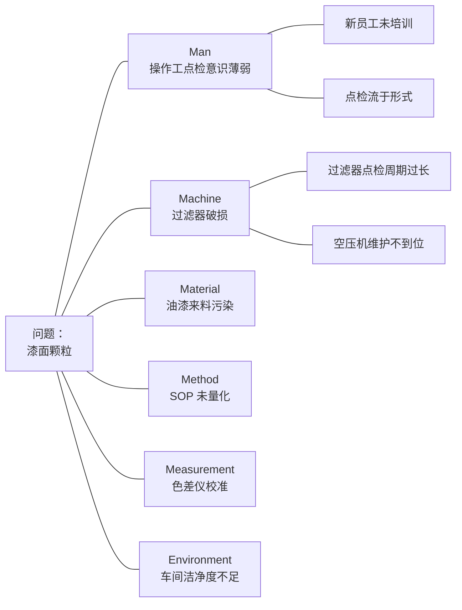

# 鱼骨图 6M 分析指南

> 本文档详细说明鱼骨图 6M 分析法，覆盖每个 M 的详细排查项、汽车零部件行业常见排查清单、鱼骨图绘制规范。

---

## 鱼骨图概述

鱼骨图（Fishbone Diagram），又称因果图（Cause-and-Effect Diagram）、Ishikawa 图，由日本质量管理大师石川馨（Kaoru Ishikawa）发明。

鱼骨图的核心价值：

1. **结构化**：将可能的原因按 6M 分类，避免遗漏
2. **可视化**：通过图形化展示问题与原因的关系
3. **引导讨论**：作为团队讨论工具，激发思路
4. **配合 5Why**：先用鱼骨图横向展开，再用 5Why 纵向深挖

---

## 6M 详细说明

6M 是鱼骨图的 6 个分支，每个 M 代表一个维度的可能原因。

### M1：Man（人）

人员相关的可能原因。

#### 排查项清单（≥5 条）

1. **资质**：操作工是否取得对应岗位的上岗资质？资质是否在有效期内？
2. **培训**：上岗前是否完成 SOP 培训？是否考核通过？是否有培训记录？
3. **经验**：操作工在该岗位的工龄？新员工占比？
4. **意识**：操作工对质量的认识？是否清楚自己的工作对下游/客户的影响？
5. **状态**：操作工当班状态如何（疲劳、情绪、身体状况）？
6. **配置**：班组人员配置是否充足？是否有顶岗现象？
7. **激励**：质量考核指标是否合理？是否有"重产量轻质量"的导向？

#### 汽车行业常见 Man 原因

- 新员工未取得上岗资质直接操作
- 操作工对 SOP 理解偏差，按个人习惯操作
- 班组人员不足，存在顶岗现象
- 焊工资质过期未及时复审
- 操作工对质量异常敏感度低，未及时停线

### M2：Machine（机）

设备/工装/模具相关的可能原因。

#### 排查项清单（≥5 条）

1. **状态**：设备当前状态如何？是否有异常报警？
2. **维护**：日常点检、定期保养是否按计划执行？记录是否完整？
3. **校准**：关键传感器/执行器是否按周期校准？校准是否在有效期内？
4. **稳定性**：关键工艺参数（温度、压力、速度等）的稳定性如何？是否有 SPC 监控？
5. **磨损**：模具/工装/定位销等关键件的磨损情况？是否有磨损量监测？
6. **备件**：关键备件库存是否充足？是否有备件更换记录？
7. **改造**：设备是否经历过改造？改造是否经过验证？

#### 汽车行业常见 Machine 原因

- 注塑机液压油温波动，未做恒温控制
- 焊接电源稳定性差，输出电流随网压波动
- 装配夹具定位销磨损，未发现
- 喷漆室送风过滤器破损
- 检具校准过期
- 模具型芯磨损，未建立磨损量监测台账

### M3：Material（料）

材料/来料相关的可能原因。

#### 排查项清单（≥5 条）

1. **批次**：本批次原料/来料的批次号？是否与上次相同？
2. **变更**：本批次原料/来料是否涉及供应商变更？是否走 ECN？
3. **检验**：IQC 检验项目是否齐全？是否覆盖关键参数？
4. **存储**：原料/来料的存储条件是否符合要求（温湿度、防潮等）？
5. **追溯**：来料是否可追溯到供应商批次？
6. **性能**：来料的关键性能参数（如硬度、粘度、细度）是否有数据？
7. **回料**：是否使用回料？回料比例是否超标？

#### 汽车行业常见 Material 原因

- 注塑原料含水率超标（未充分干燥）
- 油漆来料细度/粘度批次变异
- 焊丝批次质量变异
- 供应商原材料变更未走 ECN
- 回料比例超标，影响成品性能
- 来料尺寸超差未在 IQC 发现

### M4：Method（法）

工艺方法/SOP 相关的可能原因。

#### 排查项清单（≥5 条）

1. **存在性**：是否有对应工序的 SOP？SOP 是否在现场可获取？
2. **量化**：SOP 是否量化（如温度 200±5℃）？还是模糊描述（如"温度合适"）？
3. **完整性**：SOP 是否覆盖所有关键工序参数？是否有遗漏？
4. **更新**：SOP 是否反映最新工艺？是否有过期版本在现场使用？
5. **执行**：SOP 是否被严格执行？是否有"按经验操作"现象？
6. **首末件**：是否执行首件/末件检验？记录是否完整？
7. **SPC**：关键参数是否纳入 SPC 监控？超限是否报警？

#### 汽车行业常见 Method 原因

- SOP 未量化（如"压力合适"而非"压力 80±2bar"）
- SOP 未规定首末件检验
- 关键工艺参数未纳入 SPC 监控
- 工艺文件版本管理混乱，过期版本在现场使用
- 工艺文件未参考设备厂家维护建议
- 工艺文件编制规范未要求量化判定标准

### M5：Measurement（测）

测量/检具/检验方法相关的可能原因。

#### 排查项清单（≥5 条）

1. **校准**：检具/测量设备是否按周期校准？校准是否在有效期内？
2. **一致性**：检具与客户测量基准是否一致？是否定期与客户 CMM 比对？
3. **MSA**：测量系统是否做过 MSA（G&R&R）？是否合格？
4. **覆盖**：检验项目是否覆盖所有关键参数？
5. **频次**：检验频次是否合理？是否过度依赖末件检验？
6. **记录**：检验记录是否完整？是否可追溯？
7. **判定**：检验判定标准是否与客户一致？

#### 汽车行业常见 Measurement 原因

- 检具校准过期
- 检具与客户 CMM 基准不一致
- MSA 未做或不合格
- 检验频次不足（如只做首件，不做末件）
- 检验项目缺失（如 IQC 未检测原料含水率）
- 检验判定标准与客户不一致

### M6：Environment（环）

环境相关的可能原因。

#### 排查项清单（≥5 条）

1. **温度**：车间温度是否在工艺要求范围？是否有温度记录？
2. **湿度**：车间湿度是否在工艺要求范围？是否有湿度记录？
3. **洁净度**：车间洁净度是否符合要求（特别是涂装、电子车间）？
4. **照明**：检验工位照明是否充足？是否影响检验准确性？
5. **布局**：车间布局是否合理？是否有交叉污染风险？
6. **通风**：焊接/涂装等工序的通风是否良好？
7. **噪音/振动**：是否有外部噪音/振动影响精密工序？

#### 汽车行业常见 Environment 原因

- 注塑车间温度变化大，导致模具/原料温度波动
- 涂装车间洁净度不足，导致漆面颗粒
- 焊接车间湿度大，导致母材吸潮
- 检验工位照明不足，影响外观检验
- 喷漆室正压失效，外部尘埃进入
- 装配车间温湿度异常，导致塑料件尺寸变化

---

## 汽车零部件行业常见排查清单

针对不同缺陷类型，以下是优先排查方向：

### 涂装/漆面缺陷

| M | 优先排查项 |
|---|---|
| Man | 操作工点检意识、新员工比例 |
| Machine | 喷漆室过滤器、烘房温度、空压机 |
| Material | 油漆细度/粘度、稀释剂配比 |
| Method | SOP 是否量化、SPC 监控 |
| Measurement | 色差仪/光泽度计校准 |
| Environment | 喷漆室洁净度、温湿度、正压 |

### 装配缺陷

| M | 优先排查项 |
|---|---|
| Man | 操作工装配经验、新员工资质 |
| Machine | 装配夹具、扭力工具、定位销磨损 |
| Material | 来件尺寸批次变异、卡扣/紧固件质量 |
| Method | SOP 是否量化力矩和装配顺序、首末件检验 |
| Measurement | 检具/塞尺/力矩扳手校准 |
| Environment | 装配车间温湿度（影响塑料件尺寸） |

### 焊接缺陷

| M | 优先排查项 |
|---|---|
| Man | 焊工资质、新员工经验 |
| Machine | 焊接电源、机器人轨迹、气体流量计 |
| Material | 焊丝批次、母材表面状态、保护气纯度 |
| Method | 焊接参数 SOP、焊前清洗 SOP |
| Measurement | 探伤设备、强度测试设备校准 |
| Environment | 车间湿度、焊接区通风 |

### 尺寸超差

| M | 优先排查项 |
|---|---|
| Man | 操作工装模/调试经验 |
| Machine | 注塑机/冲床/机加工设备参数稳定性、模具定位 |
| Material | 原料批次变异、回料比例、含水率 |
| Method | 工艺 SOP 量化、首末件检验、SPC 监控 |
| Measurement | 检具/三坐标校准、与客户 CMM 比对 |
| Environment | 车间温度变化 |

---

## 鱼骨图绘制规范

### 标准鱼骨图结构

```
                    Man ─────┐
                             │
                 Material ───┤
                             │
                  ───────────┼──────── → Problem（问题描述）
                             │
                 Method ─────┤
                             │
                Machine ─────┤
                             │
              Measurement ───┤
                             │
               Environment ─┘
```

### 绘制步骤

1. **定义问题**：在右侧方框中写明问题（来自 D2 问题描述）
2. **画主干**：从左到右画一条粗箭头指向问题框
3. **画 6M 分支**：从主干画 6 条斜线，分别标注 Man/Machine/Material/Method/Measurement/Environment
4. **填原因**：每个 M 下画水平线，写具体原因（来自团队头脑风暴）
5. **标注证据**：每个原因旁标注证据来源（数据/观察/文件）
6. **圈定根因**：圈出验证后的根因，作为 D5 CA 制定的依据

### 绘制工具建议

- **简易绘制**：使用 Markdown 列表 + 缩进（适合文本报告）
- **专业绘制**：使用 Mermaid、draw.io、XMind、Excel
- **报告嵌入**：使用 PNG/SVG 图片嵌入 Word/Excel

### Mermaid 鱼骨图示例



### Markdown 鱼骨图示例（适用于 Word/Excel 嵌入）

```
问题：漆面颗粒（不良率 500 PPM，本批次退货 15 件 / 出货 30000 件）

├─ Man（人）
│  ├─ 操作工点检意识薄弱 [证据：点检表连续30天均填"正常"]
│  ├─ 新员工未取得上岗资质 [证据：HR记录]
│  └─ 班组人员配置不足
│
├─ Machine（机）
│  ├─ 喷漆室过滤器破损 [证据：送风PM2.5超标]
│  ├─ 空压机油水分离器失效 [证据：压缩空气含水检测]
│  └─ 烘房温度传感器校准过期
│
├─ Material（料）
│  ├─ 油漆来料细度超标 [证据：IQC检测]
│  └─ 稀释剂批次变异
│
├─ Method（法）
│  ├─ SOP 未量化判定标准 [证据：SOP审查]
│  └─ 关键参数未做SPC监控
│
├─ Measurement（测）
│  └─ 色差仪校准在有效期内（暂排除）
│
└─ Environment（环）
   ├─ 喷漆室正压失效 [证据：压差检测]
   └─ 车间洁净度不足
```

### 鱼骨图使用注意事项

1. **团队共创**：鱼骨图应由团队共同绘制，避免单人主观
2. **充分展开**：每个 M 下至少 3-5 个候选原因
3. **证据支撑**：每个原因尽量标注证据来源
4. **排除法**：经排查排除的原因标注"暂排除"或"已排除"
5. **不要过早收敛**：先发散后收敛，避免过早排除候选原因
6. **配合 5Why**：鱼骨图找到的方向用 5Why 深挖根因
